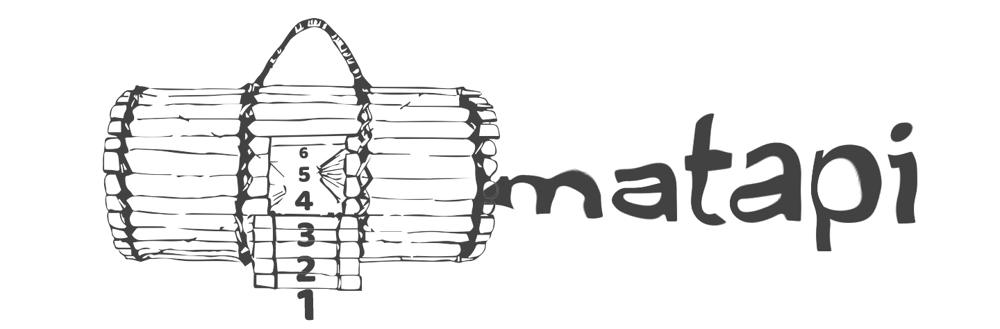

# Matapi - Random sample generation and comparison software 




[](https://doi.org/10.5281/zenodo.2652472)


Matapi is a software developed in Python that aims to compare samples and a reference file. This set is generated from a random selection of a initial file, using the `random.SystemRandom` class used to generate non-reproducible sequences.

The result of the comparisons has the quantity and percentage of common elements between reference and tested samples.

## Guide

```sh
 $ git clone https://github.com/marcosp-sousa/matapi
 $ cd matapi
 $ python3 -m matapi --extract 800 --repeat 100 --output results/ --shuffle --unique ref.csv --compare samples/*
```

### Parameters

`-e`, `--extract N`: Select N random rows from reference file

`-r`, `--repeat N`: Repeat N times

`-o`, `--output DIR`: Output directory

`--shuffle`: Shuffle reference sample

`--unique`: Remove duplicates

`ref.csv`: Reference file, in csv format

`-c`, `--compare FILE...`: Sample files to compare with reference

`-s`, `--split-size N`: Split reference into smaller parts with N size.

`-n`, `--split-number N`: Split reference into N parts.

`--delimiter`: Delimiter of csv file

### Output

The program's output is a csv file with the result of each execution.

## License

MIT License. See [LICENSE](LICENSE) for more information

## Authors

 Marcos Paulo Alves de Sousa
 
 Franklin Gonçalves Sobrinho
 
 ## Contact
 
 Dr. Marcos Paulo Alves de Sousa (Project leader)

_Email: **msousa@museu-goeldi.br**_<br>
_Laboratório de Biologia Molecular_<br>
_Museu Paraense Emílio Goeldi_<br>
_Av. Perimetral 1901. CEP 66077- 530. Belém, Pará, Brazil._
